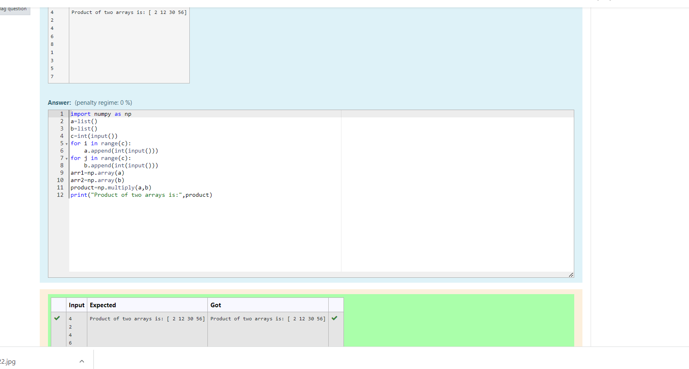

# Multiplying-two-matrix

## AIM:
To write a python program for multiplying two matrix.
## ALGORITHM:

### Step 1:
Import numpy as np.
### Step 2:
Get user from input.
### Step 3:
Create empty lists l1 and l2.
### Step 4:
Use for loop to append the values into the list created.
### Step 5:
print the product of two arrays.
## PROGRAM:
```
import numpy as np 
a=list()
b=list()
c=int(input())
for i in range(c):
    a.append(int(input()))
for j in range(c):
    b.append(int(input()))
arr1=np.array(a)
arr2=np.array(b)
product=np.multiply(a,b)
print("Product of two arrays is:",product)
``` 

## OUTPUT:



## RESULT:

